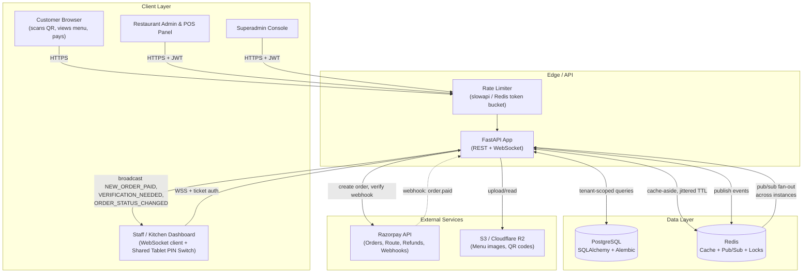
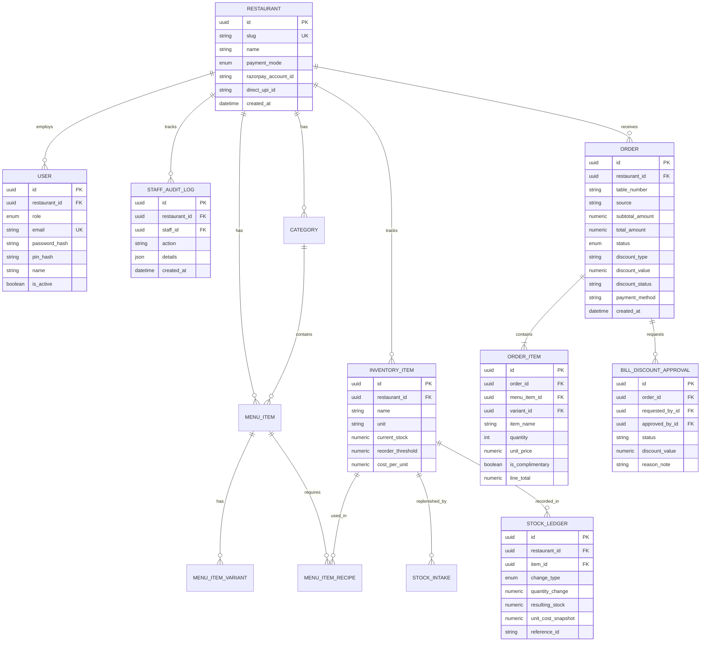
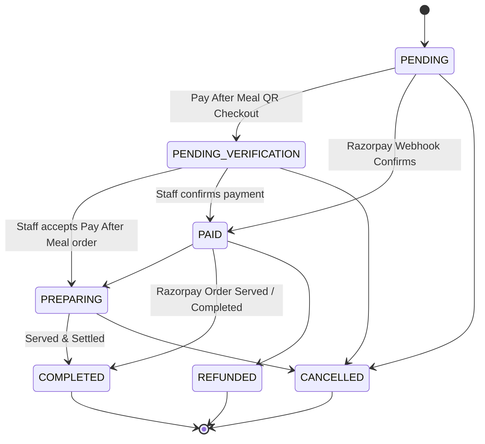
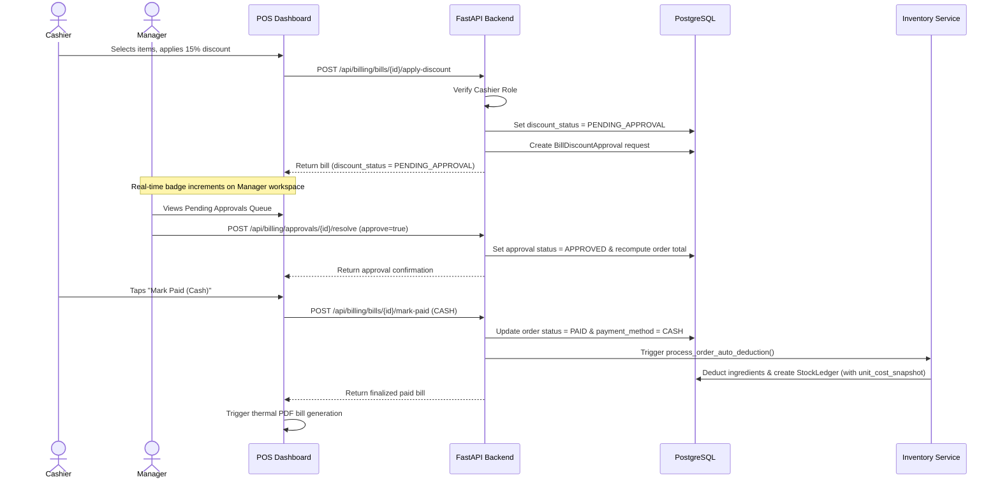
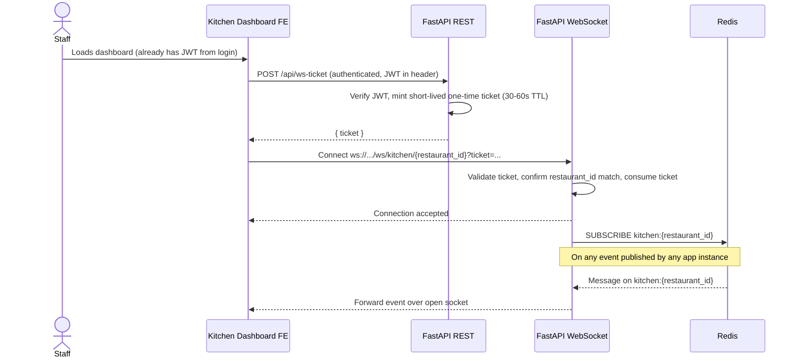
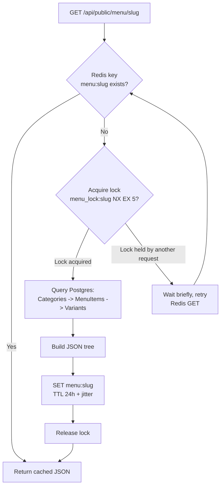

# Architecture Reference: ApnaGreen Basket — Multi-Outlet Mart Platform

> **Canonical reference document.** This file merges the full technical specification and architecture diagrams. All other docs reference this one. Update it when the spec changes — never maintain two copies.

---

# Part I — Technical Specification

---

## 0. Current Product Surfaces (Frontend)

The project ships four distinct frontend routes:

- `/` — marketing website for ApnaGreen Basket
- `/menu` — customer-facing product catalog & QR basket ordering flow
- `/admin` — operational dashboard (Live Orders, Billing POS, Product Catalog, Inventory, Analytics, Staff, Settings)
- `/superadmin` (or `/admin/superadmin`) — superadmin console for provisioning outlets & admin accounts

### Admin dashboard to backend route mapping

- `POST /api/auth/login` for admin & staff sign-in
- `POST /api/auth/pin-switch` for shared tablet PIN quick-switch
- Orders: `GET /api/admin/orders`, `PATCH /api/admin/orders/{id}/status`, `POST /api/admin/orders/{id}/confirm-payment`, `POST /api/admin/orders/{id}/cancel`, `POST /api/admin/orders/{id}/refund`
- Category CRUD: `/api/admin/categories`
- Menu item CRUD: `/api/admin/menu-items`
- Variant CRUD: `/api/admin/menu-items/{item_id}/variants`
- Staff Management: `/api/admin/staff`, `/api/admin/staff/{id}/pin`, `/api/admin/staff/permissions`, `/api/admin/staff/audit-logs`
- Inventory Management: `/api/admin/inventory/items`, `/api/admin/inventory/intakes`, `/api/admin/inventory/recipes`, `/api/admin/inventory/ledger`
- Sales Analytics: `/api/analytics/kpi-summary`, `/api/analytics/revenue`, `/api/analytics/peak-hours`, `/api/analytics/top-items`, `/api/analytics/funnel`, `/api/analytics/profit`, `/api/analytics/export-csv`
- Billing & POS: `/api/billing/bills`, `/api/billing/bills/{id}/apply-discount`, `/api/billing/approvals/{id}/resolve`, `/api/billing/bills/{id}/mark-paid`, `/api/billing/pending-approvals-count`
- Restaurant settings: `GET/PATCH /api/admin/restaurants/me`

This keeps frontend behavior strictly aligned with tenant-scoped backend contracts.

---

## 1. Project Overview

A multi-tenant platform built with FastAPI for ApnaGreen Basket — a multi-outlet fruits, vegetables & drinks mart in Jammu. Supports dynamic product catalogs with dual pricing (weight-based and fixed-unit), basket-specific QR codes, staff and inventory management, sales analytics, manual POS billing with manager discount approvals, and payments via Razorpay Gateway or Pay At Counter.

### Tech Stack
- **Backend:** FastAPI (Python 3.11+) with AsyncIO
- **Database:** PostgreSQL (SQLAlchemy 2.0 ORM & Alembic migrations)
- **Caching:** Redis (public menu reads + WebSocket pub/sub fan-out)
- **Real-time:** FastAPI WebSockets, backed by Redis pub/sub for multi-instance scaling
- **Storage:** AWS S3 / Cloudflare R2 (menu images & QR codes)
- **Payments:** Razorpay (Route/Connect) & raw UPI Deep Links
- **Auth:** JWT (short-lived access + refresh token), passwords hashed with **argon2id**, PINs hashed with **bcrypt**
- **Reports:** jsPDF + jsPDF-AutoTable (Executive A4 Analytics & Thermal Receipts)

---

## 2. Core Architecture & Multi-Tenancy Rules

**CRITICAL RULE:** This is a shared-database multi-tenant architecture. The API must never trust the frontend to provide `restaurant_id` for administrative actions.

- All admin endpoints must extract `restaurant_id` from the decoded JWT token — never from path/query/body params.
- Every database query (Read, Update, Delete) on tenant-scoped tables must append `.where(Model.restaurant_id == current_user.restaurant_id)`.
- Add a unique constraint per tenant where duplicates would be a bug, e.g. `UniqueConstraint('restaurant_id', 'name')` on `Category`.
- Write a single reusable dependency/helper (e.g. `get_tenant_scoped_query`) so this rule is enforced in one place instead of copy-pasted across every route — reduces the chance of a missed filter.

---

## 3. Database Schema (SQLAlchemy Models)

### Enums Required
- `RoleEnum`: `SUPERADMIN`, `RESTAURANT_ADMIN`, `MANAGER`, `KITCHEN_STAFF`, `CASHIER`, `WAITER`
- `PaymentModeEnum`: `RAZORPAY_GATEWAY`, `PAY_AFTER_MEAL`, `BOTH`
- `OrderStatusEnum`: `PENDING`, `PENDING_VERIFICATION`, `PAID`, `PREPARING`, `COMPLETED`, `CANCELLED`, `REFUNDED`
- `StockChangeTypeEnum`: `INTAKE`, `AUTO_DEDUCTION`, `MANUAL_ADJUSTMENT`, `RESTOCK`
- `OrderSourceEnum`: `QR`, `MANUAL`
- `DiscountTypeEnum`: `PERCENT`, `FLAT`, `COMPLIMENTARY`
- `DiscountStatusEnum`: `NONE`, `PENDING_APPROVAL`, `APPROVED`, `REJECTED`

### Global rule: money fields
**Never use `Float` for money.** Use SQLAlchemy `Numeric(10, 2)` mapped to Python `Decimal` for every price/amount field. Float rounding errors will cause real accounting discrepancies.

### Restaurant
- `id` (UUID, PK)
- `slug` (String, unique, indexed) — e.g. `mcdonalds-ny`
- `name` (String)
- `payment_mode` (Enum: `PaymentModeEnum`: `RAZORPAY_GATEWAY`, `PAY_AFTER_MEAL`, `BOTH`)
- `razorpay_account_id` (String, nullable) — for Route split payments
- `direct_upi_id` (String, nullable) — static UPI VPA for counter QR
- `raw_upi_payload` (String, nullable) — raw UPI QR payload format
- `logo_url` (String, nullable) — outlet branding logo URL
- `address`, `phone`, `gstin`, `fssai_no` (String, nullable) — outlet profile metadata for receipts & bills
- `created_at`, `updated_at` (DateTime)

### User (Staff/Admin)
- `id` (UUID, PK)
- `restaurant_id` (UUID, FK, nullable for Superadmin)
- `role` (Enum: `RoleEnum`)
- `email` (String, unique)
- `password_hash` (String)
- `pin_hash` (String, nullable) — bcrypt hash of 4-digit quick-switch PIN
- `name` (String, nullable)
- `phone` (String, nullable)
- `is_active` (Boolean, default `True`)
- `created_at`, `updated_at`

### StaffAuditLog
- `id` (UUID, PK)
- `restaurant_id` (UUID, FK)
- `staff_id` (UUID, FK)
- `action` (String)
- `details` (JSON, nullable)
- `created_at` (DateTime)

### Category
- `id` (UUID, PK)
- `restaurant_id` (UUID, FK)
- `name` (String)
- `display_order` (Integer)
- `created_at`, `updated_at`
- `UniqueConstraint('restaurant_id', 'name')`

### MenuItem
- `id` (UUID, PK)
- `restaurant_id` (UUID, FK)
- `category_id` (UUID, FK)
- `name` (String)
- `description` (Text, nullable)
- `price` (Numeric(10,2))
- `image_url` (String, nullable)
- `is_available` (Boolean, default `True`)
- `created_at`, `updated_at`

### MenuItemVariant *(sizes/add-ons)*
- `id` (UUID, PK)
- `menu_item_id` (UUID, FK)
- `name` (String) — e.g. "Large", "Extra Cheese"
- `price_delta` (Numeric(10,2)) — added to base price
- `is_available` (Boolean, default `True`)

### InventoryItem
- `id` (UUID, PK)
- `restaurant_id` (UUID, FK)
- `name` (String)
- `unit` (String: `kg`, `g`, `l`, `ml`, `pcs`)
- `category` (String)
- `current_stock` (Numeric(10,3))
- `reorder_threshold` (Numeric(10,3))
- `cost_per_unit` (Numeric(10,2))
- `is_active` (Boolean, default `True`)
- `created_at`, `updated_at`

### StockIntake
- `id` (UUID, PK)
- `restaurant_id` (UUID, FK)
- `item_id` (UUID, FK)
- `quantity` (Numeric(10,3))
- `unit_cost` (Numeric(10,2))
- `supplier_name` (String, nullable)
- `intake_date` (DateTime)
- `added_by` (UUID, FK, nullable)
- `notes` (String, nullable)
- `created_at` (DateTime)

### MenuItemRecipe
- `id` (UUID, PK)
- `menu_item_id` (UUID, FK)
- `variant_id` (UUID, FK, nullable)
- `inventory_item_id` (UUID, FK)
- `quantity_required` (Numeric(10,3))
- `unit` (String)

### StockLedger
- `id` (UUID, PK)
- `restaurant_id` (UUID, FK)
- `item_id` (UUID, FK)
- `change_type` (Enum: `StockChangeTypeEnum`)
- `quantity_change` (Numeric(10,3))
- `resulting_stock` (Numeric(10,3))
- `unit_cost_snapshot` (Numeric(10,2), nullable) — historical ingredient cost at moment of deduction
- `reference_id` (String, nullable) — e.g. Order ID
- `created_at` (DateTime)

### Order
- `id` (UUID, PK)
- `restaurant_id` (UUID, FK)
- `session_id` (UUID, FK, nullable)
- `table_number` (String)
- `customer_name` (String, nullable)
- `customer_phone` (String, nullable)
- `subtotal_amount` (Numeric(10,2), nullable)
- `total_amount` (Numeric(10,2))
- `status` (Enum: `OrderStatusEnum`)
- `source` (String, default `"qr"`) — `"qr"` | `"manual"`
- `created_by_staff_id` (UUID, FK, nullable)
- `discount_type` (String, nullable) — `"PERCENT"` | `"FLAT"` | `"COMPLIMENTARY"`
- `discount_value` (Numeric(10,2), nullable)
- `discount_reason` (String, nullable)
- `discount_status` (String, nullable) — `"NONE"` | `"PENDING_APPROVAL"` | `"APPROVED"` | `"REJECTED"`
- `payment_method` (String, nullable) — `"CASH"` | `"UPI"` | `"RAZORPAY"`
- `payment_reference` (String, nullable)
- `created_at`, `updated_at`
- `finalized_at` (DateTime, nullable)
- `paid_at` (DateTime, nullable)

### OrderItem
- `id` (UUID, PK)
- `order_id` (UUID, FK)
- `menu_item_id` (UUID, FK, nullable)
- `variant_id` (UUID, FK, nullable)
- `item_name` (String, nullable)
- `quantity` (Integer)
- `unit_price` (Numeric(10,2)) — snapshot price at order time
- `is_complimentary` (Boolean, default `False`)
- `line_total` (Numeric(10,2), nullable)

### BillDiscountApproval
- `id` (UUID, PK)
- `order_id` (UUID, FK)
- `requested_by_id` (UUID, FK)
- `approved_by_id` (UUID, FK, nullable)
- `status` (String, default `"PENDING"`) — `"PENDING"` | `"APPROVED"` | `"REJECTED"`
- `discount_type` (String)
- `discount_value` (Numeric(10,2))
- `reason_note` (String)
- `created_at` (DateTime)
- `resolved_at` (DateTime, nullable)

### WebhookEvent *(idempotency)*
- `id` (UUID, PK)
- `provider` (String) — e.g. `"razorpay"`
- `event_id` (String, unique, indexed)
- `payload` (JSONB / JSON)
- `processed_at` (DateTime)

### Order status state machine
Enforce valid transitions server-side (don't let clients set arbitrary statuses):
```
PENDING → PENDING_VERIFICATION → PAID → PREPARING → COMPLETED
PENDING → CANCELLED
PAID → REFUNDED
```
Reject any transition not on this graph (e.g. `COMPLETED → PENDING` must 400).

---

## 4. URL Structure & QR Code Generation

- **Public Menu URL:** `https://menu.app/r/{restaurant_slug}?table={table_number}`
- **QR Generation:** Generate QR codes with the `qrcode` library pointing to the public menu URL, upload to S3/R2, store the resulting URL in the DB.
- Regenerate and re-upload QR only when slug/table changes — don't regenerate on every request.

---

## 5. Caching Strategy (Redis)

**Problem:** High-volume concurrent reads on the public menu endpoint.

**Implementation:**
- Endpoint: `GET /api/public/menu/{restaurant_slug}`
- Check Redis key `menu:{restaurant_slug}`. If present, return immediately.
- If absent: query Postgres, build the JSON tree (Categories → MenuItems → Variants), cache with **TTL 24h + random jitter (e.g. ±10%)** to avoid synchronized mass expiry, return.
- **Thundering herd protection:** on cache miss, acquire a short Redis lock (e.g. `SET menu_lock:{slug} NX EX 5`) before querying Postgres; other concurrent misses wait briefly and retry the cache instead of all hitting Postgres simultaneously.
- **Invalidation:** any create/update/delete on `Category`, `MenuItem`, or `MenuItemVariant` (including `is_available` toggles) MUST clear `menu:{restaurant_slug}` synchronously in the same request.

---

## 6. Payment Architecture (Dual Support)

Behavior is selected by `Restaurant.payment_mode`.

### Mode A: Razorpay Gateway (Automated, Zero-Fee UPI)

Uses Razorpay Route to split payments; relies on webhooks for confirmation.

**Order creation**
---

## 6. Payment Architecture & Operational Modes

Behavior is determined by `Restaurant.payment_mode` (`RAZORPAY_GATEWAY`, `PAY_AFTER_MEAL`, `BOTH`) for QR diner orders, and direct settlement (`CASH`, `UPI`) for manual POS bills.

### Mode 1: Razorpay Gateway (`RAZORPAY_GATEWAY`) — Automated Online Payment
- Uses Razorpay Route for automated payment collection and merchant splitting.
- Diner initiates checkout -> total computed server-side from stored pricing -> Razorpay order created -> Razorpay Checkout widget opened.
- **Webhook confirmation (`POST /api/webhooks/razorpay`)**:
  - Raw request body read as bytes and HMAC verified against `X-Razorpay-Signature` *before* JSON parsing.
  - Idempotency verified via `WebhookEvent` table lookup by Razorpay `event_id`.
  - On `order.paid`: verifies state machine predecessor, updates `Order.status = PAID`, triggers inventory auto-deduction, and broadcasts `NEW_ORDER_PAID` event via WebSockets.

### Mode 2: Pay After Meal / Counter Settlement (`PAY_AFTER_MEAL`) — Staff Managed
- Diners place orders without upfront payment; order status transitions to `PENDING_VERIFICATION`.
- Staff receives real-time notification on kitchen board and accepts order (`PREPARING`).
- Diner pays at the counter or at table via Cash or Direct UPI (`direct_upi_id`). Staff confirms payment and completes order (`COMPLETED`).

### Mode 3: Both Options Enabled (`BOTH`) — Flexible Diner Choice
- Diners can choose between immediate Online Payment (Razorpay) or Pay at Counter (`PAY_AFTER_MEAL`) during QR menu checkout.

### POS Manual Billing & Settlement (`source="manual"`)
- Admin/Cashier creates walk-in or phone bills directly from the **Billing & POS** workspace.
- Supports item catalog picker, variant selection, quantity counters, and zero-cost complimentary items.
- Discount engine supports Percent (`%`), Flat (`₹`), and Complimentary discounts with mandatory reason notes.
  - Manager/Admin created discounts auto-approve immediately.
  - Cashier-created discounts enter `PENDING_APPROVAL`, creating a `BillDiscountApproval` entry and displaying real-time badges across manager workspace tabs.
- Payments settled via `CASH` (with live Change Calculator) or `UPI`, setting status to `PAID` and triggering recipe inventory auto-deduction.

### Refunds & Cancellations
- `POST /api/admin/orders/{order_id}/cancel` — allowed from `PENDING`, `PENDING_VERIFICATION`, or `PREPARING`. Restocks deducted inventory.
- `POST /api/admin/orders/{order_id}/refund` — allowed from `PAID`. For Razorpay orders, calls Razorpay Refund API; for cash/counter payments, records administrative refund.

---

## 7. Real-Time Kitchen Dashboard (WebSockets)

- **Connection:** `ws://api.domain.com/ws/kitchen/{restaurant_id}`
- **Auth:** Single-use, short-lived ticket (`POST /api/ws-ticket`), passed via `?ticket=...`. JWT is never passed in raw query strings.
- **Multi-instance scaling:** Redis pub/sub (`kitchen:{restaurant_id}`) fans out events across app instances.
- **Events Broadcast:** `NEW_ORDER_PAID`, `VERIFICATION_NEEDED`, `ORDER_STATUS_CHANGED`.

---

## 8. Security & Ops Checklist

- **Tenant Scoping:** All tenant DB queries filter by `restaurant_id` from decoded JWT.
- **Password & PIN Hashing:** Passwords hashed with `argon2id`; 4-digit staff PINs hashed with `bcrypt`.
- **Input Validation:** Pydantic models with `model_config = ConfigDict(extra="forbid")` on write endpoints.
- **Raw-Body Webhook Verification:** HMAC signature verified against raw bytes prior to JSON parsing.
- **Idempotency & Cost Snapshots:** Webhooks deduplicated by `event_id`; stock ledger records `unit_cost_snapshot`.
- **Alembic Migrations:** All schema changes executed via Alembic.

---

## 9. System Modules Overview

1. Multi-Tenant Superadmin Console (`/superadmin`)
2. Staff RBAC & 4-Digit PIN Quick-Switch System (`/admin` → Staff & Team)
3. Inventory Master & Recipe Auto-Deduction Engine (`/admin` → Inventory)
4. Sales & Analytics Engine & PDF Reports (`/admin` → Sales & Analytics)
5. POS Manual Billing & Discount Approvals (`/admin` → POS Billing)
6. Dual Payment Gateway & Pay-After-Meal Workflows
7. Real-time Kitchen WebSocket Dashboard

---

# Part II — Architecture Diagrams

---

## Diagram 1: System Architecture (Component View)



---

## Diagram 2: Entity-Relationship Diagram (Complete Database Schema)



---

## Diagram 3: Order Status State Machine Graph



---

## Diagram 4: Sequence — POS Manual Billing & Discount Approval Workflow



---

## Diagram 5: Sequence — WebSocket Connection & Auth



---

## Diagram 6: Redis Cache-Aside with Thundering-Herd Protection (Public Menu)



