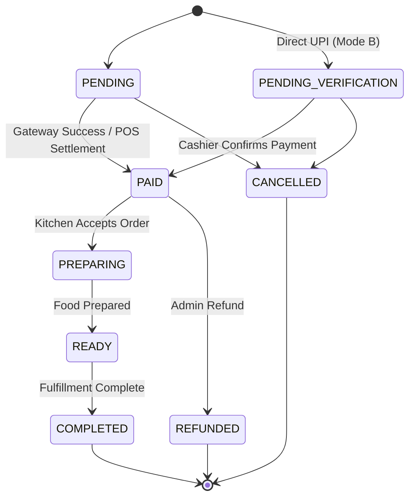
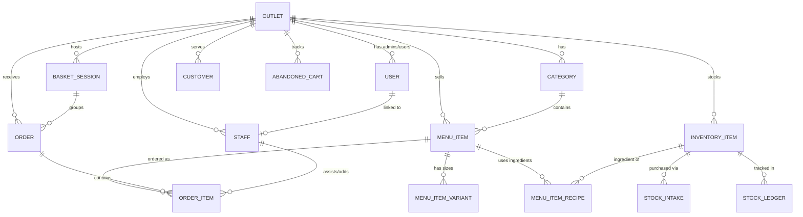
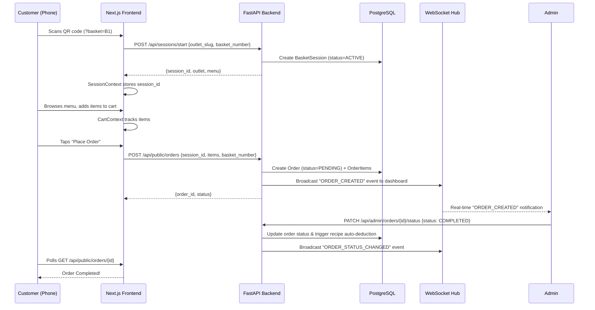
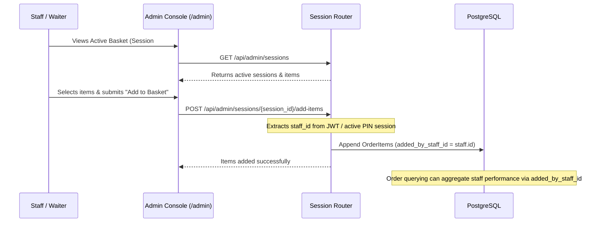
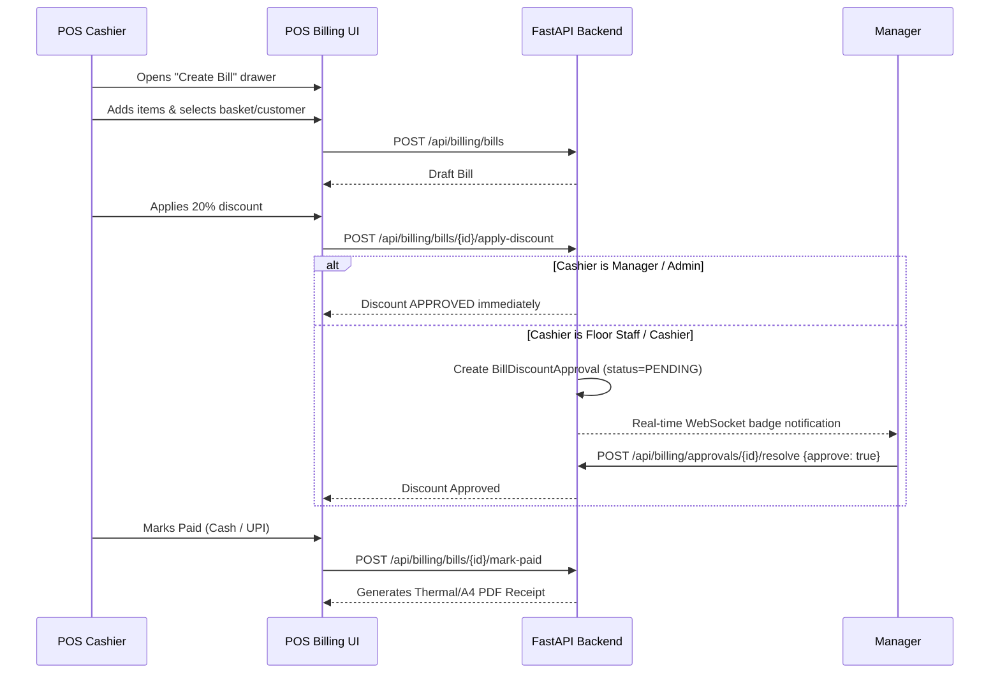
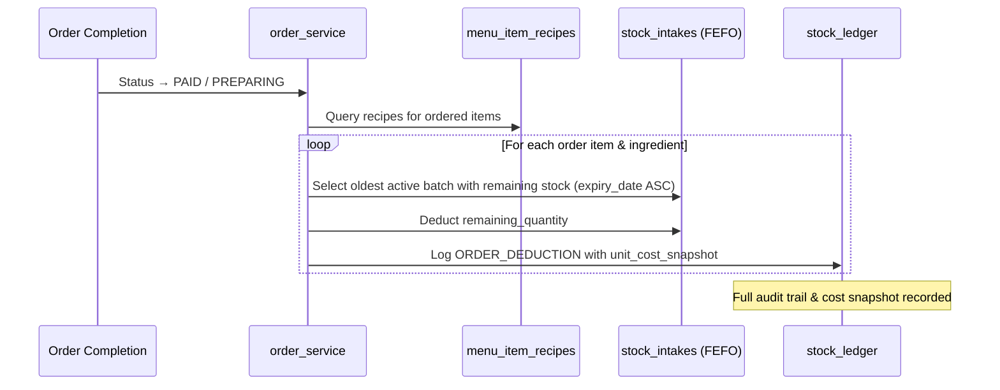

# ApnaGreenBasket — Complete Codebase Walkthrough

> A multi-tenant outlet, grocery & mart platform: QR-based basket ordering, POS billing, inventory, staff assistance, and analytics.

---

## Table of Contents

1. [Project Structure at a Glance](#1-project-structure-at-a-glance)
2. [Configuration & Environment](#2-configuration--environment)
3. [Database Layer](#3-database-layer)
   - 3.1 Engine & Session Setup
   - 3.2 Model Catalog (all 21 models)
   - 3.3 Enums & State Machines
   - 3.4 Entity Relationship Map
4. [Alembic Migrations](#4-alembic-migrations)
5. [Backend — FastAPI](#5-backend--fastapi)
   - 5.1 Application Bootstrap
   - 5.2 Authentication & Authorization
   - 5.3 API Endpoint Catalog (every route)
   - 5.4 Service Layer
   - 5.5 WebSocket Real-time Feed
6. [Frontend — Next.js](#6-frontend--nextjs)
   - 6.1 Page Routes
   - 6.2 Customer-Facing Flow
   - 6.3 Admin Dashboard (modularized)
   - 6.4 Superadmin Console
   - 6.5 Shared Infrastructure
7. [Key Data Flows](#7-key-data-flows)
   - 7.1 QR → Session → Order → Completion
   - 7.2 Staff Assistance & Item Perk Attribution
   - 7.3 POS Manual Billing & Discount Approvals
   - 7.4 Inventory Auto-Deduction & FEFO Batch Expiry
   - 7.5 Hardware Barcode Scanner & Quick Onboarding
8. [Refactor Status & Verification Summary](#8-refactor-status--verification-summary)

---

## 1. Project Structure at a Glance

```
apnagreenbasket/
├── app/                          # ⚡ FastAPI backend
│   ├── main.py                   #    App factory, lifespan, router mounts
│   ├── config.py                 #    Pydantic-settings env config
│   ├── database.py               #    SQLAlchemy async engine + Base
│   ├── dependencies.py           #    Auth, RBAC, tenant-scoping deps
│   ├── core/                     #    Security, Redis, rate limiting
│   │   ├── security.py           #    argon2id / bcrypt / JWT tokens
│   │   ├── redis.py              #    Async Redis client pool
│   │   └── rate_limit.py         #    SlowAPI rate limiter
│   ├── models/                   #    21 SQLAlchemy ORM models + enums
│   ├── schemas/                  #    Pydantic request/response contracts
│   ├── routers/                  #    REST endpoints (admin/, public/, webhooks/)
│   ├── services/                 #    Business domain services
│   └── utils/                    #    QR code SVG generation
├── alembic/                      # 🔄 Database migration scripts
│   └── versions/                 #    Fresh baseline migration (f7f19020111f_initial_schema_outlets.py)
├── frontend/                     # 🖥️ Next.js 16 App Router
│   └── src/
│       ├── app/                  #    Pages: /, /menu, /order/[id], /account, /admin, /superadmin
│       │   ├── admin/            #    Admin console with 8 tabs, 19 modularized hooks/modals
│       │   └── superadmin/       #    Superadmin multi-outlet provisioning console
│       ├── components/           #    Shared UI components (Header, CheckoutDrawer, CartFloatingBar, etc.)
│       ├── context/              #    CartContext, SessionContext
│       ├── hooks/                #    useBarcodeScanner hook
│       ├── lib/                  #    API helpers, brand config, PDF generator
│       └── types/                #    Global TypeScript type definitions
├── tests/                        # 🧪 Test directory (59 passing unit/integration tests)
├── seed.py                       # 🌱 DB seed script
└── pyproject.toml                #    Python project metadata
```

---

## 2. Configuration & Environment

### [config.py](file:///x:/apnagreenbasket/app/config.py)

All settings come from **environment variables** (`.env` file) via `pydantic-settings`. No hardcoded secrets.

| Setting Group | Key Variables | Purpose |
|---|---|---|
| **Database** | `DATABASE_URL` | PostgreSQL connection string (`postgresql+asyncpg://...`) |
| **Redis** | `REDIS_URL` | Session caching, rate-limit counters |
| **JWT** | `SECRET_KEY`, `ACCESS_TOKEN_EXPIRE_MINUTES` (60m), `REFRESH_TOKEN_EXPIRE_DAYS` (30d) | Authentication tokens & claims (`outlet_id`) |
| **Razorpay** | `RAZORPAY_KEY_ID`, `RAZORPAY_KEY_SECRET`, `RAZORPAY_WEBHOOK_SECRET` | Online payment gateway & HMAC webhook verification |
| **Direct UPI** | `DEFAULT_UPI_ID`, `DEFAULT_UPI_NAME` | Merchant VPA & Name for Mode B payment links |
| **App** | `APP_ENV`, `DEBUG`, `ALLOWED_ORIGINS`, `DASHBOARD_RESET_TIME` (04:00 AM IST) | Runtime behavior & business shift cutoff |
| **Session** | `SESSION_LOCK_DURATION_MINUTES` (30m) | Active basket session lock TTL |

> [!TIP]
> Environment parameters are strongly typed and validated during FastAPI app startup.

---

## 3. Database Layer

### 3.1 Engine & Session Setup

**File:** [database.py](file:///x:/apnagreenbasket/app/database.py)

- **Engine**: `create_async_engine` with `asyncpg` driver.
- **Session**: `async_sessionmaker` with `expire_on_commit=False` so detached objects keep their attributes.
- **Base**: `DeclarativeBase` with a consistent constraint naming convention.
- **TimestampMixin**: Adds `created_at` and `updated_at` columns with UTC timestamps.
- **get_async_session()**: FastAPI dependency — auto-commits on success, rollbacks on exception.

---

### 3.2 Model Catalog

All models are registered in [models/__init__.py](file:///x:/apnagreenbasket/app/models/__init__.py) so Alembic can discover them.

| # | Model | Table | File | Purpose |
|---|---|---|---|---|
| 1 | [Outlet](file:///x:/apnagreenbasket/app/models/outlet.py) | `outlets` | `outlet.py` | **Root tenant**. Slug, name, payment_mode, UPI/Razorpay config, session lock duration, verification rules |
| 2 | [User](file:///x:/apnagreenbasket/app/models/user.py) | `users` | `user.py` | Login accounts (email + argon2id hash). FK → `outlets`. Role enum. |
| 3 | [Category](file:///x:/apnagreenbasket/app/models/category.py) | `categories` | `category.py` | Product categories. FK → `outlets`. `display_order` for sorting. |
| 4 | [MenuItem](file:///x:/apnagreenbasket/app/models/menu_item.py) | `menu_items` | `menu_item.py` | Products. FK → `outlets` + `categories`. Price, barcode, image, availability toggle, pricing mode (FIXED / BY_WEIGHT), offer fields. |
| 5 | [MenuItemVariant](file:///x:/apnagreenbasket/app/models/menu_item_variant.py) | `menu_item_variants` | `menu_item_variant.py` | Size/quantity variants. FK → `menu_items`. `price_delta` relative to base. |
| 6 | [MenuItemRecipe](file:///x:/apnagreenbasket/app/models/menu_item_recipe.py) | `menu_item_recipes` | `menu_item_recipe.py` | Recipe link: ingredient items and required quantities per dish. FK → `menu_items` + `inventory_items`. |
| 7 | [Order](file:///x:/apnagreenbasket/app/models/order.py) | `orders` | `order.py` | Customer/POS order. FK → `outlets`, `basket_sessions`. Status state machine, discount fields, payment tracking. |
| 8 | [OrderItem](file:///x:/apnagreenbasket/app/models/order_item.py) | `order_items` | `order_item.py` | Line items in an order. FK → `orders`, `menu_items`, `staff` (`added_by_staff_id` for staff perk tracking). |
| 9 | [BasketSession](file:///x:/apnagreenbasket/app/models/basket_session.py) | `basket_sessions` | `basket_session.py` | Active customer basket session. FK → `outlets`. Tracks `basket_number`, `session_id`, `expires_at`, `status`. |
| 10 | [Customer](file:///x:/apnagreenbasket/app/models/customer.py) | `customers` | `customer.py` | Customer CRM record (phone, name, order count, total spent). FK → `outlets`. |
| 11 | [Staff](file:///x:/apnagreenbasket/app/models/staff.py) | `staff` | `staff.py` | Staff record. FK → `outlets`. Bcrypt PIN hash, active flag, role. |
| 12 | [StaffAuditLog](file:///x:/apnagreenbasket/app/models/staff_audit_log.py) | `staff_audit_log` | `staff_audit_log.py` | Immutable audit trail for staff tablet actions & PIN switches. FK → `outlets`. |
| 13 | [InventoryItem](file:///x:/apnagreenbasket/app/models/inventory_item.py) | `inventory_items` | `inventory_item.py` | Master raw ingredients & stock items. FK → `outlets`. Stock level, unit, threshold, cost. |
| 14 | [StockIntake](file:///x:/apnagreenbasket/app/models/stock_intake.py) | `stock_intakes` | `stock_intake.py` | Arrival batches: supplier, quantity, unit cost, unique batch number, expiry date (FEFO). FK → `inventory_items`. |
| 15 | [StockLedger](file:///x:/apnagreenbasket/app/models/stock_ledger.py) | `stock_ledger` | `stock_ledger.py` | Movement ledger: intake, auto-deduction, wastage, restock. FK → `inventory_items`. Stores `unit_cost_snapshot`. |
| 16 | [AbandonedCart](file:///x:/apnagreenbasket/app/models/abandoned_cart.py) | `abandoned_carts` | `abandoned_cart.py` | Cart snapshots when a session expires. FK → `outlets`. JSON cart payload. |
| 17 | [AuditLog](file:///x:/apnagreenbasket/app/models/audit_log.py) | `audit_logs` | `audit_log.py` | General administrative system audit log. FK → `outlets`. |
| 18 | [BillDiscountApproval](file:///x:/apnagreenbasket/app/models/bill_discount_approval.py) | `bill_discount_approvals` | `bill_discount_approval.py` | Manager approval requests for cashier POS discounts. FK → `orders`. |
| 19 | [WebhookEvent](file:///x:/apnagreenbasket/app/models/webhook_event.py) | `webhook_events` | `webhook_event.py` | Payment gateway webhook idempotency store (`event_id`). |

> [!NOTE]
> All models reference `outlet_id` for multi-tenant isolation. Line items support `added_by_staff_id` for staff perk tracking.

---

### 3.3 Enums & State Machines

**File:** [enums.py](file:///x:/apnagreenbasket/app/models/enums.py)

| Enum | Values | Used By |
|---|---|---|
| `RoleEnum` | SUPERADMIN, OUTLET_ADMIN, MANAGER, FLOOR_STAFF, CASHIER, KITCHEN_STAFF | `User`, `Staff` |
| `PaymentModeEnum` | RAZORPAY_GATEWAY, PAY_AFTER_MEAL, BOTH | `Outlet` |
| `OrderStatusEnum` | PENDING → PENDING_VERIFICATION → PAID → PREPARING → READY → COMPLETED / CANCELLED / REFUNDED | `Order` |
| `UnitEnum` | KG, GRAM, LITER, MILLILITER, PIECE, PACKET | `InventoryItem`, `StockIntake` |
| `StockChangeTypeEnum` | STOCK_INTAKE, ORDER_DEDUCTION, MANUAL_ADJUSTMENT, WASTAGE_SPOILAGE, WASTAGE_DAMAGED, ORDER_RESTOCK | `StockLedger` |
| `PricingModeEnum` | FIXED, BY_WEIGHT | `MenuItem` |
| `BasketSessionStatusEnum` | ACTIVE, EXPIRED, TERMINATED | `BasketSession` |

#### Order Status State Machine



Valid transitions are enforced by `is_valid_transition()` — invalid status shifts return HTTP 400.

---

### 3.4 Entity Relationship Map



Every tenant model is scoped via `outlet_id`. The `tenant_scoped_query()` helper in [dependencies.py](file:///x:/apnagreenbasket/app/dependencies.py) enforces this at the query level.

---

## 4. Alembic Migrations

**Config:** [alembic.ini](file:///x:/apnagreenbasket/alembic.ini) | **Env:** [alembic/env.py](file:///x:/apnagreenbasket/alembic/env.py)

The migration suite is consolidated into a clean, unified baseline migration script for fresh database deployments:
- `alembic/versions/f7f19020111f_initial_schema_outlets.py`: Single baseline creating all 21 tables with strict `outlets` / `outlet_id` naming, foreign keys, indexes, and precision decimal fields.

> [!IMPORTANT]
> `alembic upgrade head` applies the complete schema cleanly on new PostgreSQL databases.

---

## 5. Backend — FastAPI

### 5.1 Application Bootstrap

**File:** [main.py](file:///x:/apnagreenbasket/app/main.py)

1. **Lifespan startup**: Initializes tables via `Base.metadata.create_all`, auto-seeds a superadmin user if none exists (`superadmin@apnagreenbasket.com`).
2. **Middleware**: CORS (`allow_origins=["*"]`), SlowAPI rate limiter.
3. **Router mounts**: All admin, public, billing, inventory, analytics, webhook, and WebSocket routers mounted under `/api/` and `/ws/`.
4. **Static files**: Serves `/uploads` directory for uploaded logos and dish photos.
5. **Health check**: `GET /health` → `{"status": "healthy"}`.

---

### 5.2 Authentication & Authorization

#### Security Core — [core/security.py](file:///x:/apnagreenbasket/app/core/security.py)

| Function | Purpose |
|---|---|
| `hash_password()` / `verify_password()` | Argon2id (OWASP recommended) |
| `hash_pin()` / `verify_pin()` | Bcrypt for 4-digit staff quick-switch PINs |
| `create_access_token()` | Short-lived JWT (60m). Claims: `sub` (user_id), `outlet_id`, `role`, `type: "access"` |
| `create_refresh_token()` | Long-lived JWT (30d). Claims: same + `type: "refresh"` |
| `create_ws_ticket()` | 60-second single-use ticket containing `jti` for WebSocket auth |
| `decode_token()` | Validates & decodes JWT claims |

#### Dependencies — [dependencies.py](file:///x:/apnagreenbasket/app/dependencies.py)

| Dependency | Type Alias | What it does |
|---|---|---|
| `get_current_user()` | `AuthenticatedUser` | Decodes JWT → `CurrentUser(user_id, outlet_id, role)` |
| `require_role(...)` | `RequireAdmin`, `RequireSuperadmin`, `RequireStaffOrAdmin` | RBAC gate enforcing role requirements |
| `require_permission(perm)` | — | Checks specific permission flag (e.g. `can_manage_billing`) |
| `tenant_scoped_query()` | — | Adds `.where(model.outlet_id == current_user.outlet_id)` to queries |
| `get_async_session()` | `DBSession` | Yields DB session with auto-commit/rollback |

---

### 5.3 API Endpoint Catalog

#### Auth — [auth.py](file:///x:/apnagreenbasket/app/routers/auth.py) — prefix: `/api/auth`

| Method | Path | Auth | Description |
|---|---|---|---|
| POST | `/register` | Admin+ | Register new outlet user |
| POST | `/login` | Public | Email + password → access_token + refresh_token |
| POST | `/refresh` | Public | Rotate refresh token → new token pair |
| POST | `/logout` | Auth | Revoke session |
| POST | `/pin-switch` | Staff+ | Authenticate staff member via 4-digit PIN |

---

#### Admin Outlets — [outlets.py](file:///x:/apnagreenbasket/app/routers/admin/outlets.py) — prefix: `/api/admin/outlets`

| Method | Path | Auth | Description |
|---|---|---|---|
| GET | `/me` | Admin+ | Get current user's outlet profile |
| PUT | `/me` | Admin+ | Update outlet settings (payment mode, session lock TTL, UPI details) |

---

#### Categories — [categories.py](file:///x:/apnagreenbasket/app/routers/admin/categories.py) — prefix: `/api/admin/categories`

| Method | Path | Auth | Description |
|---|---|---|---|
| GET | `/` | Admin+ | List all categories for outlet |
| POST | `/` | Admin+ | Create category (invalidates Redis menu cache) |
| GET | `/{category_id}` | Admin+ | Get single category |
| PATCH | `/{category_id}` | Admin+ | Update category |
| DELETE | `/{category_id}` | Admin+ | Delete category |

---

#### Menu Items — [menu_items.py](file:///x:/apnagreenbasket/app/routers/admin/menu_items.py) — prefix: `/api/admin/menu-items`

| Method | Path | Auth | Description |
|---|---|---|---|
| GET | `/` | Admin+ | List all menu items for outlet |
| GET | `/barcode/{barcode}` | Admin+ | Fast product lookup by barcode for POS |
| POST | `/` | Admin+ | Create menu item & initial variants |
| GET | `/{item_id}` | Admin+ | Get single menu item |
| PATCH | `/{item_id}` | Admin+ | Update item (price, barcode, offers, image) |
| DELETE | `/{item_id}` | Admin+ | Delete menu item |

---

#### Orders (Admin) — [orders.py](file:///x:/apnagreenbasket/app/routers/admin/orders.py) — prefix: `/api/admin/orders`

| Method | Path | Auth | Description |
|---|---|---|---|
| GET | `/` | Staff+ | List dashboard orders for current business shift (04:00 AM reset) |
| GET | `/{order_id}` | Staff+ | Get single order with items |
| PATCH | `/{order_id}/status` | Staff+ | Transition order status (enforces state machine) |
| POST | `/{order_id}/confirm-payment` | Staff+ | Confirm Direct UPI (Mode B) counter payment |
| POST | `/{order_id}/cancel` | Admin+ | Cancel order & auto-restock inventory |
| POST | `/{order_id}/refund` | Admin+ | Refund paid order via Razorpay / admin record |

---

#### Sessions (Admin) — [sessions.py](file:///x:/apnagreenbasket/app/routers/admin/sessions.py) — prefix: `/api/admin/sessions`

| Method | Path | Auth | Description |
|---|---|---|---|
| GET | `/` | Staff+ | List active basket sessions & lock statuses |
| POST | `/{session_id}/add-items` | Staff+ | **Staff add items to active customer basket (tags staff ID)** |
| POST | `/{session_id}/terminate` | Staff+ | Force-terminate active session |
| GET | `/abandoned-carts` | Staff+ | View abandoned cart snapshots |
| POST | `/abandoned-carts/{id}/convert` | Staff+ | Convert abandoned cart into new order |

---

#### Inventory — [inventory.py](file:///x:/apnagreenbasket/app/routers/admin/inventory.py) — prefix: `/api/admin/inventory`

| Method | Path | Auth | Description |
|---|---|---|---|
| GET | `/items` | Admin+ | List ingredient master items |
| POST | `/items` | Admin+ | Create new inventory ingredient |
| POST | `/intake` | Admin+ | Record stock arrival batch with batch number & expiry date |
| GET | `/ledger` | Admin+ | Paginated movement ledger with unit cost snapshots |
| POST | `/recipes` | Admin+ | Save recipe mapping (menu item → ingredients) |
| GET | `/alerts` | Admin+ | Low stock threshold alerts |
| GET | `/near-expiry-alerts` | Admin+ | FEFO near-expiry batch alerts |
| GET | `/barcode/{barcode}` | Admin+ | Hardware scanner item lookup |
| POST | `/scan-increment` | Admin+ | Scanner auto-increment stock count |
| POST | `/scan-onboard` | Admin+ | Scanner first-time product onboarding |
| POST | `/wastage` | Admin+ | Log stock loss, spoilage or transit damage |

---

#### Billing — [billing.py](file:///x:/apnagreenbasket/app/routers/admin/billing.py) — prefix: `/api/billing`

| Method | Path | Auth | Description |
|---|---|---|---|
| POST | `/bills` | Staff+ | Create draft manual POS bill |
| PUT | `/bills/{bill_id}` | Staff+ | Update draft bill line items |
| POST | `/bills/{bill_id}/apply-discount` | Staff+ | Apply discount (% / flat / complimentary) with approval routing |
| POST | `/approvals/{id}/resolve` | Manager+ | Approve or reject pending discount request |
| POST | `/bills/{bill_id}/finalize` | Staff+ | Lock draft bill from further edits |
| POST | `/bills/{bill_id}/mark-paid` | Staff+ | Record Cash or UPI settlement and mark paid |
| GET | `/pending-approvals-count` | Manager+ | Get pending discount badge count for managers |

---

#### Analytics — [analytics.py](file:///x:/apnagreenbasket/app/routers/admin/analytics.py) — prefix: `/api/analytics`

| Method | Path | Auth | Description |
|---|---|---|---|
| GET | `/kpi-summary` | Admin+ | KPI summary strip with period-over-period % deltas |
| GET | `/revenue` | Admin+ | Time-bucketed revenue (hourly, daily, weekly, monthly) |
| GET | `/peak-hours` | Admin+ | Order volume distribution by hour (0-23) |
| GET | `/top-items` | Admin+ | Top selling items by quantity or revenue share |
| GET | `/funnel` | Admin+ | Conversion funnel metrics |
| GET | `/profit` | Admin+ | Profit margin analysis (Revenue - COGS via cost snapshots) |
| GET | `/export` | Admin+ | Download analytics report as CSV file |

---

#### Public Routers — [public/](file:///x:/apnagreenbasket/app/routers/public/) — prefix: `/api/public` & `/api/sessions`

| Method | Path | Auth | Description |
|---|---|---|---|
| GET | `/api/public/outlets` | Public | List active public outlets |
| GET | `/api/public/menu/{outlet_slug}` | Public | Read Redis-cached menu catalog |
| POST | `/api/sessions/start` | Public | Start or resume customer QR basket session |
| POST | `/api/public/orders` | Public | Place customer QR order |
| GET | `/api/public/orders/{id}` | Public | Poll live order ticket status |

---

### 5.4 Service Layer

All business domain rules are located in [services/](file:///x:/apnagreenbasket/app/services/):

- `session_service.py`: Basket session locking, 30-min TTL extension, abandoned cart capture, and staff assistance item additions (`staff_add_items_to_session`).
- `order_service.py`: Checkout execution, verification rule evaluation, status transitions, and recipe auto-deduction/restock.
- `inventory_service.py`: FEFO batch allocation, barcode intake/onboarding, wastage logging, and `unit_cost_snapshot` ledger recording.
- `billing_service.py`: POS manual bill creation, discount approval workflows, and Cash/UPI settlement.
- `staff_service.py`: Staff CRUD, 4-digit PIN bcrypt verification, and audit logging.
- `analytics_service.py`: PostgreSQL SQL aggregations for KPI summary, peak hours, top items, conversion funnel, and profit margins.
- `payment_service.py`: Razorpay order creation, UPI deep-link generation, and HMAC webhook processing.
- `websocket_service.py`: In-memory `outlet_id` WebSocket connection manager and event broadcasts.

---

### 5.5 WebSocket Real-time Feed

**File:** [ws.py](file:///x:/apnagreenbasket/app/routers/ws.py) + [websocket_service.py](file:///x:/apnagreenbasket/app/services/websocket_service.py)

1. Admin frontend requests a WS ticket via `POST /api/ws-ticket` (returns a 60-second single-use JWT with unique `jti`).
2. Client connects to `ws://host/ws/mart/{outlet_id}?ticket=<ticket>`.
3. Server validates ticket signature and single-use `jti`.
4. Real-time events (`ORDER_CREATED`, `ORDER_STATUS_CHANGED`, `DISCOUNT_APPROVAL_REQUESTED`, `STOCK_ALERT`) are broadcasted to all connected outlet clients.

---

## 6. Frontend — Next.js

### 6.1 Page Routes

| Route | File | Surface | Description |
|---|---|---|---|
| `/` | [page.tsx](file:///x:/apnagreenbasket/frontend/src/app/page.tsx) | Public | High-converting landing & outlet selection page |
| `/menu` | [menu/page.tsx](file:///x:/apnagreenbasket/frontend/src/app/menu/page.tsx) | Public | Customer QR ordering UI (Search, Cart, Checkout Drawer, Ticket Slip) |
| `/order/[id]` | [order/[id]/page.tsx](file:///x:/apnagreenbasket/frontend/src/app/order) | Public | Customer order tracking ticket page |
| `/account` | [account/page.tsx](file:///x:/apnagreenbasket/frontend/src/app/account/page.tsx) | Public | Customer order history by phone |
| `/admin` | [admin/page.tsx](file:///x:/apnagreenbasket/frontend/src/app/admin/page.tsx) | Admin | Outlet operations console (8 tabs, dark/light theme) |
| `/superadmin` | [superadmin/page.tsx](file:///x:/apnagreenbasket/frontend/src/app/superadmin/page.tsx) | Superadmin | Multi-outlet provisioning console |

---

### 6.2 Customer-Facing Flow

The customer QR ordering flow utilizes React Context for state management:
- `SessionContext`: Manages `session_id`, basket number, lock status, and 30-min TTL timer.
- `CartContext`: Client-side cart item addition, variant selection, quantities, and subtotal computation.
- `CheckoutDrawer`: Renders payment methods (`RAZORPAY_GATEWAY` or `PAY_AFTER_MEAL`) and customer details.

---

### 6.3 Admin Dashboard (Modularized)

The admin dashboard is modularized into **19 focused files**:

```
frontend/src/app/admin/
├── page.tsx                         # Main Dashboard Shell (State owner & tab orchestrator)
├── adminTypes.ts                    # Admin TypeScript interfaces & types
├── adminUtils.ts                    # Formatting & API helpers
├── hooks/
│   ├── useAdminAuth.ts              # JWT token state, login, logout
│   ├── useAdminTheme.ts             # Dark/light glassmorphism theme toggle
│   ├── useOrdersManagement.ts       # Order status transitions & shift filters
│   ├── useBillingManagement.ts      # POS manual billing & discount approvals
│   ├── useInventoryManagement.ts    # Inventory master, intake & barcode scanner
│   ├── useMenuManagement.ts         # Categories & product CRUD
│   ├── useStaffManagement.ts        # Staff list, roles & PIN setup
│   └── useAnalyticsManagement.ts    # KPI & analytical charts state
├── tabs/
│   ├── OrdersTab.tsx                # Kitchen Display Board & order state machine
│   ├── BillingTab.tsx               # Walk-in POS manual billing & discount queue
│   ├── MenuTab.tsx                  # Category & menu item management
│   ├── InventoryTab.tsx             # Master inventory, intakes, recipes & barcode scanner
│   ├── StaffTab.tsx                 # Staff roster, PIN setup & audit trail
│   ├── AnalyticsTab.tsx             # Charts, KPIs, peak hours & CSV exports
│   ├── QrCodesTab.tsx               # Printable QR code generator for baskets
│   └── SettingsTab.tsx              # Outlet profile, payment modes & lock TTL
└── modals/
    ├── StaffAssistBasketModal.tsx   # Staff Basket Assistance Modal
    ├── CreateBillDrawer.tsx          # Full-screen POS bill creation drawer
    ├── DiscountModal.tsx             # Discount application form
    ├── PaymentModal.tsx              # Cash/UPI settlement modal with change calculator
    ├── LogWastageModal.tsx          # Inventory stock wastage form
    ├── BarcodeRegisterModal.tsx     # Hardware barcode scanner onboarding modal
    ├── VariantModal.tsx              # Product size/variant manager
    ├── OfferModal.tsx                # Special offer pricing modal
    ├── StaffModal.tsx                # Add/edit staff member modal
    ├── PinModal.tsx                  # Set staff 4-digit PIN modal
    └── PinSwitchModal.tsx            # Quick-switch POS operator modal
```

---

### 6.4 Superadmin Console

**Files:** [superadmin/page.tsx](file:///x:/apnagreenbasket/frontend/src/app/superadmin/page.tsx) + [useSuperadminData.ts](file:///x:/apnagreenbasket/frontend/src/app/superadmin/hooks/useSuperadminData.ts)

Includes modular components:
- `SuperadminHeader`: Branding & logout.
- `SuperadminLoginForm`: Superadmin login interface.
- `OutletCard`: Displays outlet details, associated admins, and action triggers.
- `CreateOutletWizard`: Multi-step outlet creation & admin user provisioning.
- `EditOutletModal`: Outlet settings editor.

---

### 6.5 Shared Infrastructure

| File | Purpose |
|---|---|
| [lib/api.ts](file:///x:/apnagreenbasket/frontend/src/lib/api.ts) | `getApiBaseUrl()` — resolves backend URL from env or defaults |
| [lib/brand.ts](file:///x:/apnagreenbasket/frontend/src/lib/brand.ts) | Brand colors, logos, and theming constants |
| [lib/pdfGenerator.ts](file:///x:/apnagreenbasket/frontend/src/lib/pdfGenerator.ts) | Client-side A4 & thermal PDF receipt generation |
| [hooks/useBarcodeScanner.ts](file:///x:/apnagreenbasket/frontend/src/hooks/useBarcodeScanner.ts) | Hardware barcode scanner keypress buffer hook |
| [types/index.ts](file:///x:/apnagreenbasket/frontend/src/types/index.ts) | Global TypeScript interfaces (`Outlet`, `BasketSession`, `Order`, `StaffMember`) |

---

## 7. Key Data Flows

### 7.1 QR → Session → Order → Completion



---

### 7.2 Staff Assistance & Item Perk Attribution



---

### 7.3 POS Manual Billing & Discount Approvals



---

### 7.4 Inventory Auto-Deduction & FEFO Batch Expiry



---

### 7.5 Hardware Barcode Scanner & Quick Onboarding

```mermaid
flowchart TD
    Scan([Hardware Barcode Scanner]) --> Lookup[GET /api/admin/inventory/barcode/{barcode}]
    Lookup --> Check{Found in InventoryItem?}

    Check -- Yes --> IncModal[Open Scan Increment Modal]
    IncModal --> SubmitInc[POST /api/admin/inventory/scan-increment]
    SubmitInc --> AddBatch[Create StockIntake Batch & Add StockLedger]

    Check -- No --> OnboardModal[Open Onboard Wizard Modal]
    OnboardModal --> SubmitOnboard[POST /api/admin/inventory/scan-onboard]
    SubmitOnboard --> CreateItem[Create InventoryItem & Initial FEFO StockIntake]
```

---

## 8. Refactor Status & Verification Summary

### Refactoring Completed ✅
- **Domain Alignment**: All models, routes, services, schemas, and frontend DTOs updated to `Outlet`, `outlet_id`, `outlet_slug`, `BasketSession`, `basket_number`, and `OUTLET_ADMIN`.
- **Staff Assistance & Perk Attribution**: Implemented `added_by_staff_id` on `OrderItem` and `POST /api/admin/sessions/{session_id}/add-items` for staff basket assistance.
- **Fresh Baseline Migration**: Created clean baseline migration `f7f19020111f_initial_schema_outlets.py`.
- **Modular Admin Console**: Admin console refactored into 19 modular hooks, tabs, and modals.

### Automated Test Suite Results ✅
- **Pytest Execution**: **59 Passed, 1 Skipped** (100% green test suite across auth, barcode inventory, expiry alerts, catalog, state machine, verification pipeline, webhooks, and WebSocket tickets).

### Frontend Build Verification ✅
- **TypeScript & Next.js Build**: `npm run build` completed successfully with **0 errors**.
